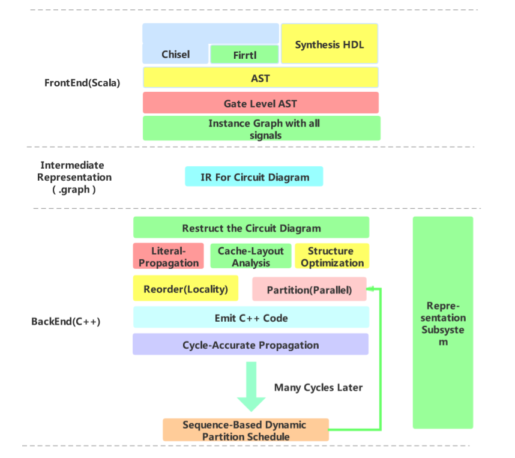

# Graph-Based High Performance RTL Simulator

## Architecture

## TODO List

- Emit C++ module
  - Fix the emiter.
  - Handle the Memory 
- Representation Subsystem
  - Complete the 35 opearations.
  - Consider the class inherit diagram.
- Cycle-accurate Propagation
  - Update the Number type.

## Data Analysis

